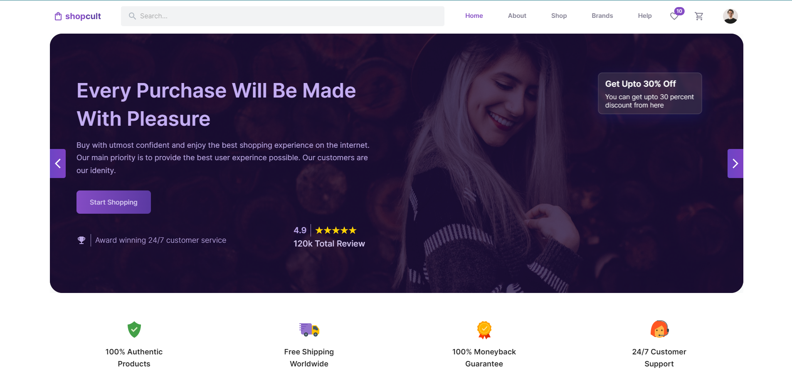

# **SHOPCULT**

Shopcult is a fully fledged modern e-commerce website, built using various modern services and technologies such as ReactJS, Redux Toolkit, Material UI, CommerceJS, Firebase, Stripe, SwiperJS etc. It includes some amazing features such as authentication, wishlisting items, filtering items, adding items to cart, placing orders, payment gateway and much more! <a href="https://shopcult.netlify.app" target="_blank">Visit</a>

## **ABOUT**

This is a personal project created for learning and development purposes. The main movtive behind creating such a big and complex project is to familiarize myself with as much complexities as possible. Because things like authentication, payment gateway, state management are some of the essential parts of any modern website, therefore implementing these features was a major target in this project. Although some of the features are in test mode only.

## **TOOLS & TECHNOLOGIES USED**
- ReactJS
- React Router
- Redux Toolkit
- Material UI
- Firebase
- CommerceJS
- SwiperJS
- React Hook Form
- Yup Schema Validation
- Google Maps
- Canvas Confetti
